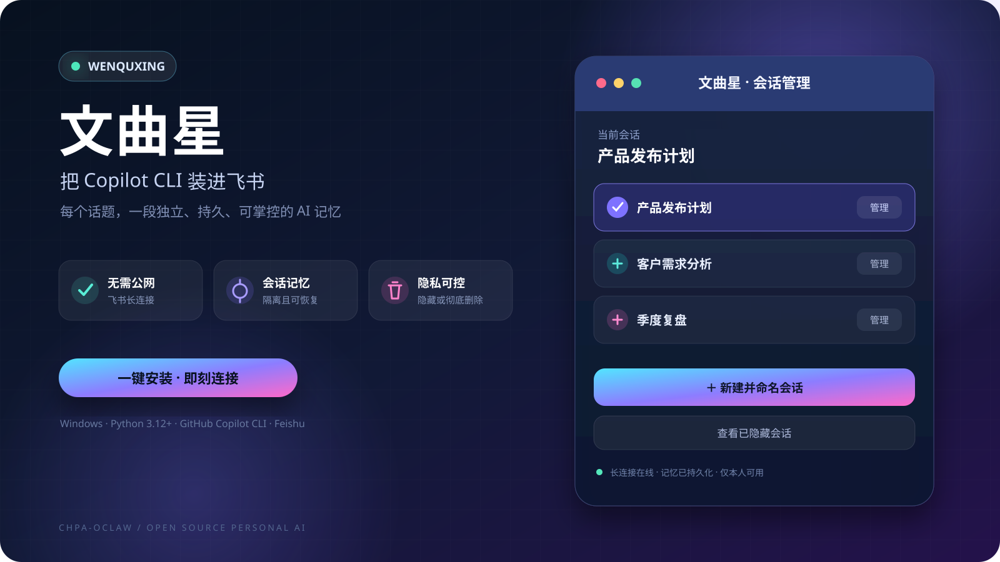

<div align="center">
  

  # Wenquxing

  **把 GitHub Copilot CLI 装进飞书，给每个话题一段独立、可恢复的记忆。**

  [](#)
  [](#)
  [](#)
  [](LICENSE)
</div>

## 它能做什么

文曲星通过飞书自建应用的 WebSocket 长连接接收本人私聊消息，使用指定的
GitHub Copilot CLI session 处理，再把结果返回飞书。无需公网服务器或回调 URL。

- **会话记忆**：每个会话对应独立 Copilot session，重启后继续上下文。
- **卡片管理**：在飞书卡片中直接新建、命名、切换、编辑和删除会话。
- **可恢复隐藏**：会话可从列表隐藏，消息和记忆完整保留，未来随时恢复。
- **彻底删除**：确认后删除文曲星消息、映射和对应 Copilot 本地记忆。
- **可靠接入**：按 `message_id` 去重，SQLite 持久化任务，文件操作全局串行。
- **会话文件夹**：每个会话拥有独立本地目录，文件与对话记忆一起隔离和保留。
- **多文件分析**：Copilot 自行读取图片、Office/PDF、文本与代码，并分析视频关键帧和 ZIP。
- **文件回传**：生成或修改后的图片、文档和压缩包可自动上传并发送回当前飞书单聊。
- **富文本附件**：支持飞书中“文字指令 + 文件”合并发送的 `post` 富文本消息。
- **安全图片编辑**：内置受限图片加字工具，无需向 Copilot 开放任意 Shell。
- **最小权限**：仅允许配置的租户、本人和机器人单聊；Copilot 禁用网络与 MCP。

## 应用界面

<div align="center">
  
  <br>
  <sub>飞书会话管理卡片，展示内容为脱敏示意数据。</sub>
</div>

## 一键安装

### 方式一：发布包

1. 下载并解压 [`dist/Wenquxing-v0.4.1-windows.zip`](dist/Wenquxing-v0.4.1-windows.zip)。
2. 双击 `install.bat`。
3. 按提示填写飞书 `App ID`、`App Secret`、`tenant_key` 和本人 `open_id`。
4. 按 [飞书配置指南](docs/CONFIGURATION.md)启用长连接并发布应用。

### 方式二：源码安装

```powershell
Set-ExecutionPolicy -Scope Process Bypass
.\install.ps1
```

安装器会检查 Python 3.12+ 和 Copilot CLI，创建独立虚拟环境、保护凭据、执行诊断、
配置当前用户登录自启动并启动文曲星。已有 v01/v02 飞书凭据会自动复用。

## 飞书内使用

发送 `会话` 打开卡片管理界面。界面不显示内部编号：

1. 点击 **新建并命名会话**，输入名称并保存。
2. 点击会话名称切换上下文。
3. 点击 **管理**，可改名、隐藏或永久删除。
4. 在 **已隐藏会话** 中恢复，或确认后永久删除。

文字命令 `新会话 名称`、`进入会话 名称`、`命名会话 名称`、`当前会话`、
`清除上下文` 作为兼容回退。

直接向机器人发送附件即可保存到当前会话的专属目录。Copilot CLI 以全部文曲星会话目录
为受管工作区，可跨会话读取、创建、修改、移动和删除文件；图片和 Office/PDF 同时使用
原生附件能力。视频会生成视觉关键帧，ZIP 经安全解压后由 Copilot 逐项分析。权限不会扩展
到文曲星会话根目录之外，网络保持禁用。发送“在图片上增加 Hello Vic！然后发给我”等
指令时，Copilot 会调用受限图片工具生成新文件，文曲星再上传并发送到当前飞书单聊。

## 文档

| 文档 | 内容 |
|---|---|
| [安装与飞书配置](docs/CONFIGURATION.md) | 从创建应用到长连接上线的完整步骤 |
| [架构与安全](docs/ARCHITECTURE.md) | 数据流、会话模型、权限边界与删除语义 |
| [运维与排障](docs/OPERATIONS.md) | 日志、诊断、升级、备份及常见错误码 |

## 项目结构

```text
wenquxing/
├─ install.bat / install.ps1   # 一键安装
├─ uninstall.ps1               # 可选保留数据的卸载
├─ src/wenquxing_v2/           # 应用源码
├─ tests/                      # 会话、删除和安全测试
├─ docs/                       # 部署及运维文档
├─ media/                      # 宣传素材
└─ dist/                       # 可分发 ZIP
```

## 安全提示

不要把 `.env`、App Secret、SQLite 数据库或 `%USERPROFILE%\.copilot` 上传到 GitHub。
Copilot CLI 会接触用户发给机器人的文本；使用前请确认组织政策、账号权限和数据处理要求。
